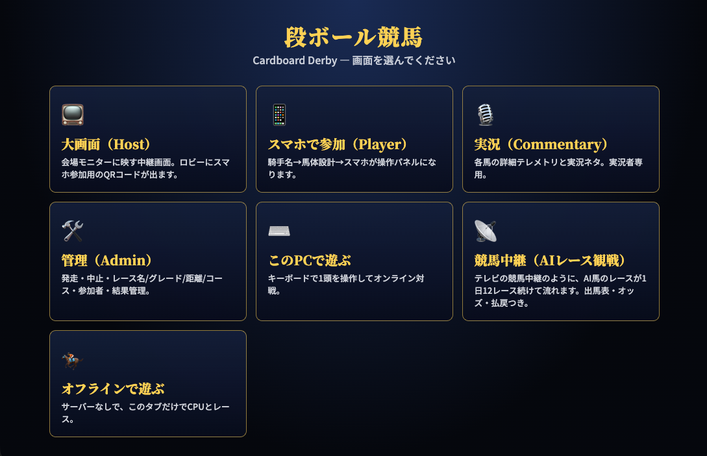
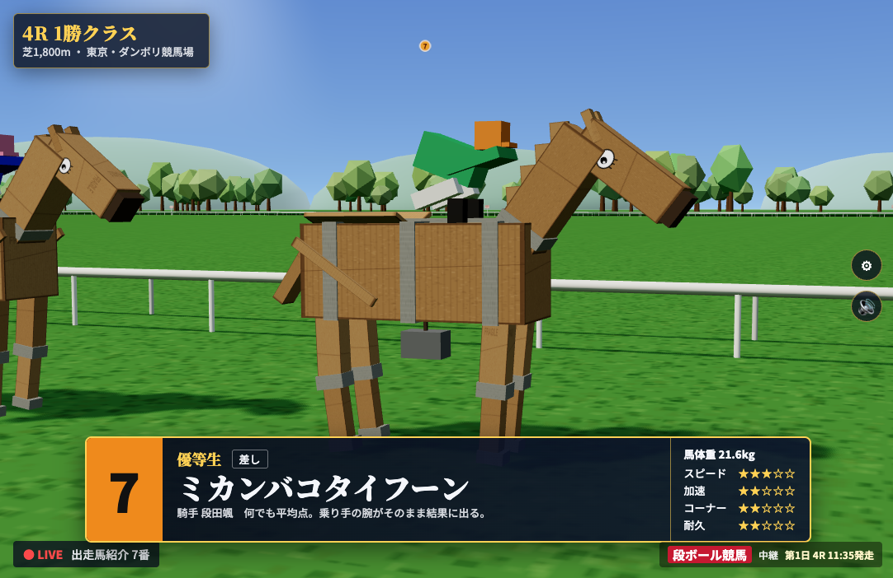
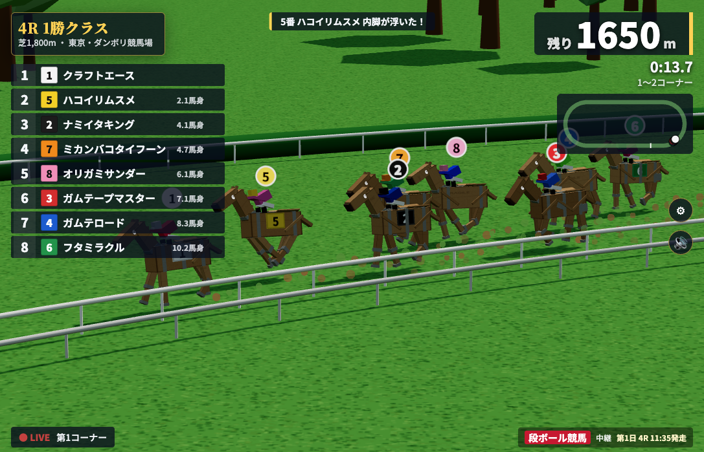
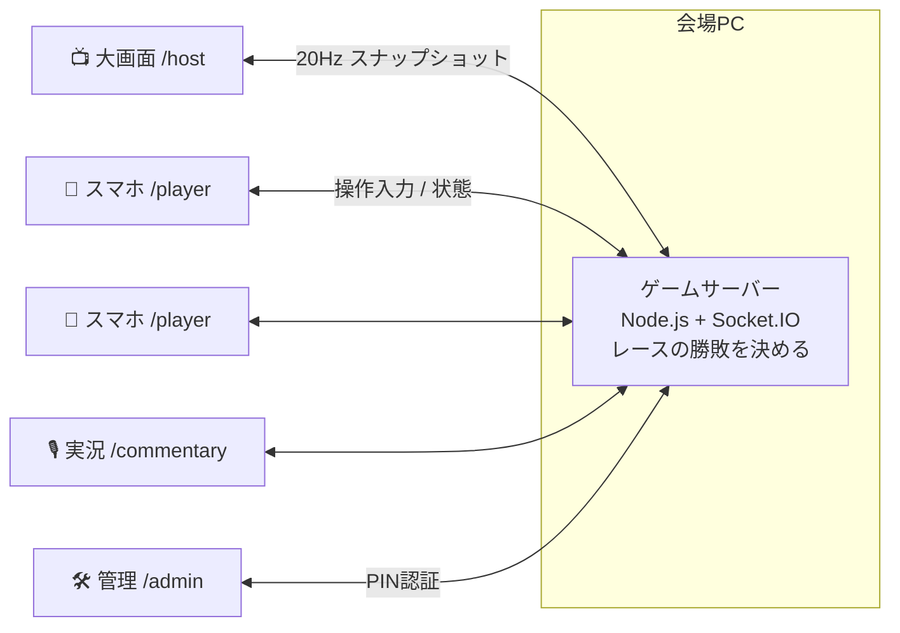
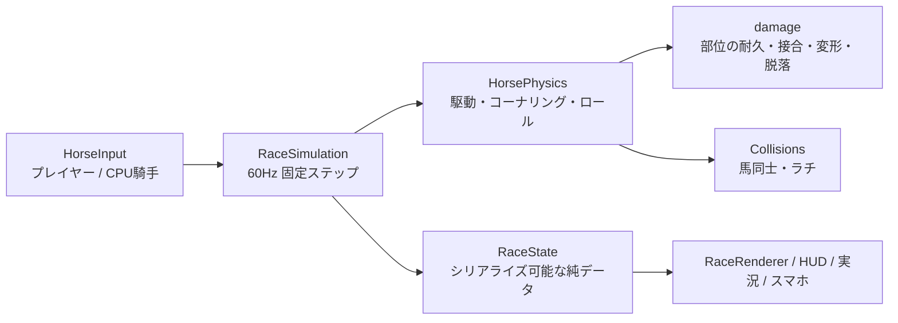

<div align="center">

# 📦🏇 段ボール競馬 — Cardboard Derby

**走る。壊れる。それでも、前へ。**

段ボールで作った馬が、本気の競馬中継の中で走って、転んで、ガムテープで直されながらゴールを目指す<br>
スマホで遊べるパーティーゲーム（Three.js + Node.js）

---

### 🤖 このゲームは、Claude Code（Opus 5.5）が一括生成しました

**仕様書 [`PROJECT_SPEC.md`](PROJECT_SPEC.md) を除くソースコード・テスト・ドキュメントは、すべて [Claude Code](https://claude.com/claude-code) + Claude Opus 5.5 が書きました。**<br>
人間が入力したのは次Phaseへの移行指示だけ。<br>設計・実装・テスト・バランス調整・不具合修正・ドキュメント作成まで、Claude Code が自分で考え、自分で動かして確かめながら仕上げました。

|         TypeScript          |   CSS   | ゲーム内の画像・3D・音声 |        実行時の依存ライブラリ        |
| :-------------------------: | :-----: | :----------------------: | :----------------------------------: |
| **約12,300行 / 83ファイル** | 約880行 | **0個**（コードで生成）  | three / socket.io / qrcode の3つだけ |

</div>

> [!NOTE]
> 3Dモデル（段ボール馬・スタンド・ゲート）、テクスチャ、ファンファーレや歓声などの音声は、すべて実行時にコードで生成しています。`docs/` にある画像・動画は README 用の紹介素材です。

### プレイ映像

▶️ **[レース動画を再生（約3分）]**

### スクリーンショット

|                    メインメニュー                    |              出走馬紹介              |              レース中継              |
| :--------------------------------------------------: | :----------------------------------: | :----------------------------------: |
|  |  |  |

---

## 目次

- [これは何？](#これは何)
- [Claude Code Opus 5.5 による一括生成](#claude-code-opus-55-による一括生成)
- [主な機能](#主な機能)
- [📺 競馬中継モード（AIレース観戦）](#-競馬中継モードaiレース観戦)
- [クイックスタート](#クイックスタート)
- [イベントでの遊び方（大画面 + スマホ）](#イベントでの遊び方大画面--スマホ)
- [画面一覧](#画面一覧)
- [操作方法](#操作方法)
- [ゲームシステム](#ゲームシステム)
- [大会モード](#大会モード)
- [設定・URLオプション・環境変数](#設定urlオプション環境変数)
- [開発者向け情報](#開発者向け情報)
- [テストと検証ツール](#テストと検証ツール)
- [パフォーマンス](#パフォーマンス)
- [既知の制限](#既知の制限)
- [ライセンス](#ライセンス)

---

## これは何？

**段ボール競馬**は、会場の大画面に映すテレビの競馬中継風の3D画面と、参加者のスマホのコントローラーで遊ぶパーティーゲームです。

- 参加者は QR コードを読み取り、**騎手名を入れて自分の段ボール馬を設計**します（脚の長さ、車幅、段ボールの厚さ、補強、ガムテープの量、重心）。
- レース中のスマホは操作パネルになります。**加速・減速・進路・踏ん張る・ピットイン**を操作します。
- 馬は**物理シミュレーション**で走ります。コーナーで攻めすぎると内脚が浮いて転倒し、ぶつかればガムテープが剥がれ、部品が取れます。
- 大画面は**本物の競馬中継のような演出**です。G1のタイトル、ファンファーレ、出走馬紹介、ゲート、実況テロップ、リプレイ、確定掲示板まであります。
- 「速い馬が勝つ」のではなく、**壊れずにゴールまで走りきった馬が勝つ**ゲームです。

AI の馬だけのレースを、テレビ中継のように1日12レース眺め続ける [**競馬中継モード**](#-競馬中継モードaiレース観戦) もあります。

---

## Claude Code Opus 5.5 による一括生成

### 作り方

1. 人間が、作りたいゲームを [`PROJECT_SPEC.md`](PROJECT_SPEC.md)（約1,000行）に書きました。ゲームの目標、物理の考え方、演出、10段階の開発計画が書かれています。
2. Claude Code（Opus 5.5）に「**PROJECT_SPEC.mdをみて、Phase1を実行してほしい**」と頼みました。
3. 以降は、フェーズが終わるたびに「**次のPhaseの実行**」と指示しただけです。

Claude Code は各フェーズで、次の作業を人の手を借りずに繰り返しました。

- **設計と実装**：仕様を読み、必要なファイルとモジュールを決めて実装する
- **自分で動かして確かめる**：ブラウザで画面を開いてスクリーンショットで確認し、ヘッドレスのシミュレーションで数百レースを走らせ、Bot のスマホを40台つないで負荷試験をする
- **数字を見て直す**：勝率の偏り、転倒の多さ、フレームレート、通信量などを測り、パラメータやアルゴリズムを調整する
- **見つけた不具合を直す**：再接続の取りこぼし、トークン漏洩、スマホでの画面はみ出し、タップの取りこぼしなどを直す

### フェーズごとの成果

| Phase | 内容                     | 主な成果物                                                                                                               |
| :---: | ------------------------ | ------------------------------------------------------------------------------------------------------------------------ |
|   1   | 3Dレースの試作           | 楕円コース、段ボール馬のモデル、CPU 6頭のレース、中継カメラ                                                              |
|   2   | ゲーム性と物理           | 横G・転倒（ロール）物理、踏ん張る、構造疲労、接触判定、CPU騎手                                                           |
|   3   | 損傷と修理               | 部位ごとの耐久・接合・変形・脱落、ピットインとガムテープ修理、修理後の劣化                                               |
|   4   | 馬体設計                 | 6種のスライダー → 質量と性能を自動計算、ビルドタイプ（異名）の自動判定                                                   |
|   5   | 中継演出                 | G1タイトル、合成音のファンファーレ、出走馬紹介、リプレイ、確定掲示板、紙吹雪                                             |
|   6   | サーバー／クライアント化 | サーバーが勝敗を決める権威サーバー、20Hzスナップショット、補間・補外                                                     |
|   7   | スマホでの対戦           | QR 参加、タッチ操作、切断時の CPU 代走と復帰、端末ごとの本人確認トークン                                                 |
|   8   | 大画面・実況・管理画面   | 実況用テレメトリと実況ネタの自動抽出、管理画面（PIN 認証）、結果の保存                                                   |
|   9   | 大会モード               | 予選 → 準決勝 → 決勝、組分け、統計、特別賞の表彰式                                                                       |
|  10   | 仕上げと最適化           | 画質プリセット、解像度の自動調整、メッシュ統合、パーティクル、効果音、振動、アクセシビリティ、通信の差分圧縮、CPU の強さ |
|   +   | **競馬中継モード**       | AI だけのレースが続く TV 中継。出馬表、試走から求めたオッズ、払戻、馬の戦績                                              |

> 生成の詳しい記録は [`docs/HOW_IT_WAS_BUILT.md`](docs/HOW_IT_WAS_BUILT.md) にあります。

---

## 主な機能

### 🏇 物理で走る段ボール馬

- コーナーでは**横Gで馬体が傾き**、限界を超えると**内脚が浮いて転倒**します。重心が高い馬や細い馬ほど不安定です。
- **踏ん張る**と転倒寸前から立て直せます。ただし「疲労度UP」が溜まり、馬体の**構造疲労**が進みます。
- 部位ごと（4本の脚・首・尾・胴）に**耐久・接合強度・変形**があり、ぶつかるとガムテープが剥がれ、脚が曲がり、最後は**取れます**。
- **ピットイン**すると、その場でガムテープで修理します。修理を重ねるほど最大耐久は落ちていきます。

### 🛠 馬体設計

- 脚の長さ・車幅・段ボールの厚さ・補強・ガムテープ量・重心の6項目には、どれも長所と短所があります。
- 設計した形から質量・最高速・加速・コーナー限界・耐久・修理時間が決まり、「**直線番長**」「**ちゃぶ台**」「**紙装甲**」「**ガチガチ亀さん**」などの**異名**が自動で付きます。

### 📺 本物っぽい競馬中継

- グレード別のタイトル（G1は金と★★★）と、**音声ファイルを使わず WebAudio で合成した**オリジナルのファンファーレがあります。
- 出走馬紹介、ゲートイン、発走のベル、実況テロップ、順位ボード、残り距離、ミニマップを表示します。
- 中継カメラが自動で切り替わります（スタート地点、向正面、第3〜第4コーナー、最終直線の正面、ゴール前、ウイナー）。ゴール後はスローのリプレイと、転倒シーンのリプレイを流します。
- 着差（ハナ・アタマ・クビ・1 3/4 …）、上がり3F、転倒・修理・接触の回数、構造疲労を載せた**確定掲示板**を出します。

### 📱 スマホで最大6人同時対戦

- 大画面のロビーに出る QR コードを読み取るだけで参加できます。アプリのインストールは不要です。
- 通信が切れたり画面を消したりすると **CPU が代わりに走り**、戻ると操作が戻ります。
- 自分の馬だけの振動フィードバックがあります（Android）。

### 🎙 実況画面と 🛠 管理画面

- 実況者向けに、全馬のテレメトリ（速度・傾き・疲労・部位の損傷）と、**自動で抽出した「実況ネタ」**を表示します。
- 管理者は、発走・中止・やり直し、レース名・グレード・コース・距離の設定、参加者の枠の入れ替え、結果履歴の書き出しができます。

### 🏆 大会モード

- 最大40人規模を想定した**予選 → 準決勝 → 決勝**のトーナメントです。最後に「最大衝撃記録賞」「七転び八起き賞」「部品紛失賞」など10種類の**特別賞**を表彰します。

---

## 📺 競馬中継モード（AIレース観戦）

> **`/tv`** を開くと、テレビの競馬中継を見ているように、AI 馬のレースが次々に流れます。操作は不要です。

<table>
<tr><td>

**1日の流れ（1開催 = 1競馬場で12レース）**

| R       | 時刻      | クラス                           |
| ------- | --------- | -------------------------------- |
| 1R〜3R  | 10:05〜   | 新馬・未勝利                     |
| 4R〜8R  |           | 1勝・2勝クラス                   |
| 9R      | 14:05     | ○○特別                           |
| 10R     | 14:35     | オープン                         |
| **11R** | **15:10** | **メインレース（G1 / G2 / G3）** |
| 12R     | 15:45     | 最終レース                       |

</td><td>

**レースの合間に流れるもの**

- 📋 **番組表**：本日の全レースと、終わったレースの勝ち馬・単勝配当
- 🐎 **出馬表**：馬番、印、馬名、異名、騎手、脚質、近走、戦績
- 💹 **オッズ**：バックグラウンドで集計されて変動していく単勝オッズと人気
- 🤖 **AI予想**：◎○▲△☆ の印と、本命・穴馬
- ⏱ **発走までのカウントダウン**

</td></tr>
</table>

### 仕組み

- **オッズは本当にシミュレーションして決めています。** 出走の前に **Web Worker** の中で同じ物理エンジンを使い、そのレースを60回試走します。勝った回数から勝率を求め、獲得賞金から見た世間の評判を少し混ぜ、控除率20%をかけて単勝オッズにします。描画とは別のスレッドで動くので、中継は止まりません。
- **毎回「調子」が違います。** 馬ごとに、その日の調子（最高速 ±4%）と道中のペースが変わります。過去4日分（48レース）のテストでは、1番人気の勝率が31%、3着以内が67%でした。実際の競馬（約33% / 64%）に近く、ときどき8番人気が勝ちます。
- **約30頭の所属馬**がいます。元の6頭に、名前・馬体・騎手を自動で作った馬を加えています。新馬戦は初出走の馬、メインレースは賞金上位の馬、というように**クラスに合った馬**が選ばれ、2レース以上の間隔を空けて出走します。
- **戦績が積み上がります。** 着順・勝利数・獲得賞金・近走は、ブラウザ（localStorage）に保存されます。ページを開き直しても、その日の続きから再開します。
- **払戻**：確定掲示板に、単勝・複勝・馬連の配当と人気を表示します。万馬券が出ると「万馬券！」と表示されます。
- **1日の終わり**には、全レースの勝ち馬・最高配当・転倒数・脱落した部品の数・最多勝騎手をまとめて表示し、次の開催日（別の競馬場）に進みます。
- 普通のレースは紹介を短めに、メインレースは長いタイトルと出走馬紹介でじっくり見せます。

### 操作とオプション

| キー              | 動作                                                     |
| ----------------- | -------------------------------------------------------- |
| `Enter` / `Space` | すぐ発走／タイトル・紹介・リプレイを飛ばす／次のレースへ |
| `M`               | ミュート                                                 |
| `F`               | 全画面                                                   |
| ⚙                 | 画質・音量などの設定                                     |

| URL            | 意味                                                |
| -------------- | --------------------------------------------------- |
| `/tv`          | 競馬中継モード（前回の続きから）                    |
| `/tv?reset`    | 第1日からやり直す（所属馬も作り直す）               |
| `/tv?races=3`  | 1日のレース数（最後の N レース。`3` なら 10R〜12R） |
| `/tv?guide=15` | レース間の番組表を表示する秒数（既定 30）           |
| `/tv?speed=2`  | レースの進行速度                                    |

> 💡 ブラウザは、ユーザーが操作するまで音を出せません。最初に一度、画面をクリックするかキーを押してください。

---

## クイックスタート

**必要なもの**：Node.js 22.12 以上（または 20.19 以上）、最近の Chrome / Edge / Safari / Firefox

```bash
git clone https://github.com/accuex/Cardboard_Derby.git
cd Cardboard_Derby
npm install
npm run dev
```

ブラウザで **http://localhost:5173** を開くと、画面を選ぶメニューが出ます。

| まず試すなら                          | URL                                |
| ------------------------------------- | ---------------------------------- |
| AI レースをぼーっと眺める             | http://localhost:5173/tv           |
| 1人でキーボードで遊ぶ（サーバー不要） | http://localhost:5173/play?offline |
| 大画面＋スマホで対戦する              | http://localhost:5173/host         |

### 本番（イベント会場）での起動

```bash
npm run build   # 型チェックと本番ビルド
npm start       # ゲームサーバーが dist/ も配信 → http://<このPCのIP>:3000
```

---

## イベントでの遊び方（大画面 + スマホ）

1. 会場の PC で `npm start` を実行し、プロジェクターやテレビに **`/host`** を映します。
2. 参加者は、**同じ Wi-Fi に接続した**スマホで、大画面のロビーに出る **QR コード**を読み取ります。
3. スマホで **騎手名 → 馬体設計** を済ませると、ロビーに自分の枠が表示されます。空いた枠は CPU が走ります。
4. 管理者（`/admin`）が発走させます。自動発走の設定もあります。
5. 実況する人は **`/commentary`** を手元に開くと、実況ネタが自動で流れてきます。



---

## 画面一覧

| URL           | 用途                                                                                                                    |
| ------------- | ----------------------------------------------------------------------------------------------------------------------- |
| `/`           | メニュー                                                                                                                |
| `/host`       | 大画面：中継映像、ロビー（QR コード）、大会のトーナメント表、表彰式                                                     |
| `/player`     | スマホ：騎手名 → 馬体設計 → タッチコントローラー（追走カメラ付き）                                                      |
| `/commentary` | 実況：全馬のテレメトリ、自動抽出の実況ネタ、イベントログ、馬ごとの詳細                                                  |
| `/admin`      | 管理：発走・スキップ・中止・やり直し、レース設定、自動発走、参加者管理、結果履歴（JSON 書き出し）、CPU の強さ、大会運営 |
| `/play`       | この PC のキーボードでオンライン対戦（`?offline` でサーバーなし）                                                       |
| **`/tv`**     | **競馬中継モード：AI レースを順番に観戦**                                                                               |

---

## 操作方法

### キーボード（`/play`）

| キー      | 動作                                                     |
| --------- | -------------------------------------------------------- |
| `↑`       | 全力（何も押さないと巡航）                               |
| `↓`       | 減速                                                     |
| `←` / `→` | 内へ / 外へ                                              |
| `Space`   | **踏ん張る**（転倒しそうな時に耐える。疲労度UPが溜まる） |
| `P`       | ピットイン（修理）。もう一度押すと取り消し               |
| `V`       | 中継映像と追走カメラを入れ替える                         |
| `R`       | もう一度レース                                           |
| `B`       | 馬体を作り直す                                           |
| `Enter`   | タイトル・紹介・リプレイを飛ばす                         |
| `M`       | ミュート                                                 |

### スマホ（`/player`）

**ステアリングパッド**を左右にドラッグして進路（内／外）を選び、押している間だけ効く **アクセル**・**ブレーキ**・**踏ん張る** ボタンと、**ピット** ボタンで操作します（マルチタッチ対応）。画面には自分の馬の追走カメラと、傾き・疲労・部位の損傷が表示されます。

---

## ゲームシステム

### 馬体設計のトレードオフ

| 項目           | 増やすと                           | 代わりに                           |
| -------------- | ---------------------------------- | ---------------------------------- |
| 脚の長さ       | 最高速アップ                       | 重心が上がり、コーナーで転びやすい |
| 車幅           | 転びにくい                         | 空気抵抗で最高速が少し落ちる       |
| 段ボールの厚さ | 壊れにくい                         | 重くなり加速が落ちる               |
| 補強           | 耐久・接合強度・コーナー限界アップ | 重くなり、修理に時間がかかる       |
| ガムテープ量   | 接合部が剥がれにくい               | 重さと修理時間が増える             |
| 重心（下げる） | 転びにくい                         | 重りの分だけ重い                   |

ビルドタイプ（異名）：`直線番長` `コーナー職人` `ロケット` `紙装甲` `ガチガチ亀さん` `ちゃぶ台` `竹馬` `ガムテープの塊` `優等生` `欠陥建築` `個性派`

### レースの物理



- **コーナリング**：速度² / 半径 で横Gを計算し、馬体の静的な安定限界（重心の高さと車幅で決まる）と比べて、傾き（ロール）が増えます。
- **踏ん張る**：傾きの回復が速くなる代わりに「疲労度UP」が溜まり、構造疲労が進みます。
- **構造疲労**：コーナーの負荷、踏ん張り、衝突で溜まり、溜まるほど最高速と安定性が落ちます。
- **損傷**：部位ごとに、耐久（段ボール）・接合強度（ガムテープ）・変形・脱落があります。脚が取れると走りが大きく乱れます。
- **修理**：ピットインで止まって直します。修理時間は質量・補強・テープの量・損傷の大きさで決まり、直すたびに最大耐久が下がります。

調整できる値はすべて `src/config/` にあります（`physics.ts`、`damage.ts`、`horses.ts`、`build.ts`、`race.ts`、`camera.ts`、`render.ts`）。

---

## 大会モード

- `/admin` でモードを「大会」に切り替えると、スマホからの参加登録（騎手名＋馬体）が始まります。CPU の参加者を追加することもできます。
- **組分け**はシャッフルと手動移動ができます（満員の組へ移動すると入れ替えになります）。組分けの後に登録があった場合は、一番人数の少ない組に入ります。
- 予選は1組最大6頭です。35人なら 6/6/6/6/6/5 の6組になり、各組の上位2頭が準決勝、さらに上位3頭が決勝に進みます。参加者が少なければ、いきなり決勝です。
- 大画面には、レースの合間にトーナメント表が、最後に**表彰式**（10種類の特別賞）が出ます。
- データは `data/tournament.json`、統計付きのレース履歴は `data/results.json` に保存されます。

---

## 設定・URLオプション・環境変数

### ⚙ 設定パネル（全画面共通・ブラウザに保存）

- 画質：自動 / 高 / 中 / 低。フレームレートに合わせて描画解像度も自動で調整します。
- 音量：全体 / ファンファーレ / 効果音 / 歓声
- 振動（スマホ）、動き・点滅を減らす（OS の設定に従う）、文字を大きく

### URL オプション

| オプション                 | 意味                                                 |
| -------------------------- | ---------------------------------------------------- |
| `?offline`                 | サーバーなしで、このタブだけで動かす                 |
| `?quick`                   | 馬体設計とタイトルを飛ばす                           |
| `?seed=123`                | 同じレースを再現する（オフライン）                   |
| `?speed=2`                 | シミュレーションの速度                               |
| `?horse=3`                 | 3番の枠に乗る（オフライン）                          |
| `?watch`                   | 全頭 CPU で観戦                                      |
| `?grade=G1` / `?race=名前` | グレードとレース名（オフライン）                     |
| `?cpu=easy\|hard`          | CPU の強さ（オフライン。オンラインは管理画面で設定） |

### 環境変数（サーバー）

| 変数        | 既定値             | 意味                                                     |
| ----------- | ------------------ | -------------------------------------------------------- |
| `GAME_PORT` | `3000`             | ゲームサーバーのポート                                   |
| `ADMIN_PIN` | 起動ごとにランダム | 他の端末から管理画面を開くときの PIN（このPCからは不要） |
| `DATA_DIR`  | `./data`           | 結果と大会データの保存先                                 |
| `SIM_SPEED` | `1`                | レースの進行速度（テスト用、1〜15）                      |

---

## 開発者向け情報

### 技術スタック

- **クライアント**：TypeScript 7 / Vite 8 / Three.js r186 / WebAudio / Web Worker
- **サーバー**：Node.js / Socket.IO 4（perMessageDeflate）/ tsx
- **その他**：qrcode（ロビーの QR）

### ディレクトリ構成

```
src/
  config/      調整用の値はすべてここ（コース・レース・馬・物理・損傷・設計・カメラ・描画）
  core/        シード付き乱数、数学ヘルパー
  sim/         描画に依存しないシミュレーション（Course, RaceSimulation, HorsePhysics,
               Collisions, CpuRider, damage, performance, buildType）
  game/        RaceFlow（タイトル→紹介→ゲート→レース→ゴール→リプレイ→確定）、Replay、
               Session（オンライン／オフライン共通の窓口）、Tournament、RaceStats
  render/      Three.js：コース、スタンド、観客、大型ビジョン、ゲート、段ボール馬、中継カメラ、土埃
  ui/          DOM オーバーレイ：HUD、タイトル、出走馬紹介、確定掲示板、設定、合成音声、紙吹雪
  net/         通信プロトコル（差分エンコード）、NetSession（補間・補外）
  phone/       スマホ画面とタッチ操作
  commentary/  実況画面と実況ネタの抽出
  admin/       管理画面
  tv/          競馬中継モード（番組・所属馬・オッズ Worker・番組表）
server/        権威サーバー：ロビー、枠の割り当て、レース進行、スナップショット、本人確認トークン、
               CPU代走、大会、結果保存、/api/info・/api/stats
scripts/       ヘッドレスのテスト・バランス検証・負荷試験
```

### 設計の原則

- **シミュレーションと描画を分ける**：データは `HorseInput → RaceSimulation → RaceState → 描画/UI` の一方向にしか流れません。同じシミュレーションのコードが、サーバー・ブラウザ・Web Worker（オッズの試走）・テスト用スクリプトで動きます。
- **プレイヤーも CPU も同じ物理で走る**：違うのは `HorseInput` を誰が作るかだけです。
- **権威サーバー**：勝敗はサーバーが決めます。クライアントは入力を送り、届いたスナップショットを補間して描画します（遅延は通信状況に合わせて調整し、届かない間は補外）。
- **ハードコードしない**：調整できる値は `src/config/` に集めています。

詳しくは [`docs/ARCHITECTURE.md`](docs/ARCHITECTURE.md) を見てください。

---

## テストと検証ツール

```bash
npm run typecheck        # 型チェック
npm run sim:test         # ヘッドレスで数百レース：脚質ごとの勝率、転倒率、イベント数
npm run tv:sim -- 4      # 競馬中継モードを4日分ヘッドレスで回す：1番人気の勝率、配当、タイム
npm run tournament:sim -- 35   # 35人の大会をヘッドレスで最後まで
npm run net:test         # Botクライアント2台で1レース（サーバー起動中に）
npm run net:reconnect    # 切断→CPU代走→復帰、画面オフ、ピットの一瞬タップ（等速のサーバーで）
npm run net:admin        # 管理画面のPINと権限（ADMIN_PIN=4321 で起動したサーバーで）
npm run net:tournament   # ネットワーク越しに大会を通しで（SIM_SPEED=10 DATA_DIR=/tmp/x）
npm run bots -- http://localhost:3300 40 --tournament   # Botのスマホ40台で大会全体の負荷試験
npx tsx scripts/difficulty.ts                           # CPUの強さごとのプレイヤー勝率
```

---

## パフォーマンス

Claude Code が自分で計測した値です。

| 項目                                            | 値                                           |
| ----------------------------------------------- | -------------------------------------------- |
| 描画回数（高画質 / 軽量）                       | 470 / 312（メッシュ統合前は665）             |
| 描画の CPU 時間 / フレーム                      | 0.75ms（高画質）                             |
| サーバーの1回の処理（Bot 40台・大会全11レース） | 平均 0.12ms・最悪 7.65ms                     |
| スナップショット（圧縮後）                      | 約 0.5KB → スマホ1台あたり 約 9.6KB/秒       |
| 到着間隔のばらつき                              | ±2ms                                         |
| オッズの試走（Web Worker）                      | 1レース約60〜90ms × 60回をバックグラウンドで |

---

## 既知の制限

- iPhone（Safari）は振動 API に対応していないため、振動しません。
- 振動、効果音の聞こえ方、実機スマホでの見た目は、自動テストとブラウザのスマホ表示でしか確かめていません。本番の前に、実機でリハーサルすることをおすすめします。
- 競馬中継モードは、ブラウザごとに独立したオフラインのモードです（サーバーとは同期しません）。
- ブラウザは、ユーザーが操作するまで音声を再生できません。

---

## ライセンス

[MIT License](LICENSE)

---

<div align="center">

**🤖 Built entirely with [Claude Code](https://claude.com/claude-code) · Claude Opus 5.5**

_Every line of code in this repository — the physics, the 3D models, the synthesized fanfare, the server,<br>the tests and this README — was written by Claude Code from a single spec, one "Phase N GO!" at a time._

</div>
