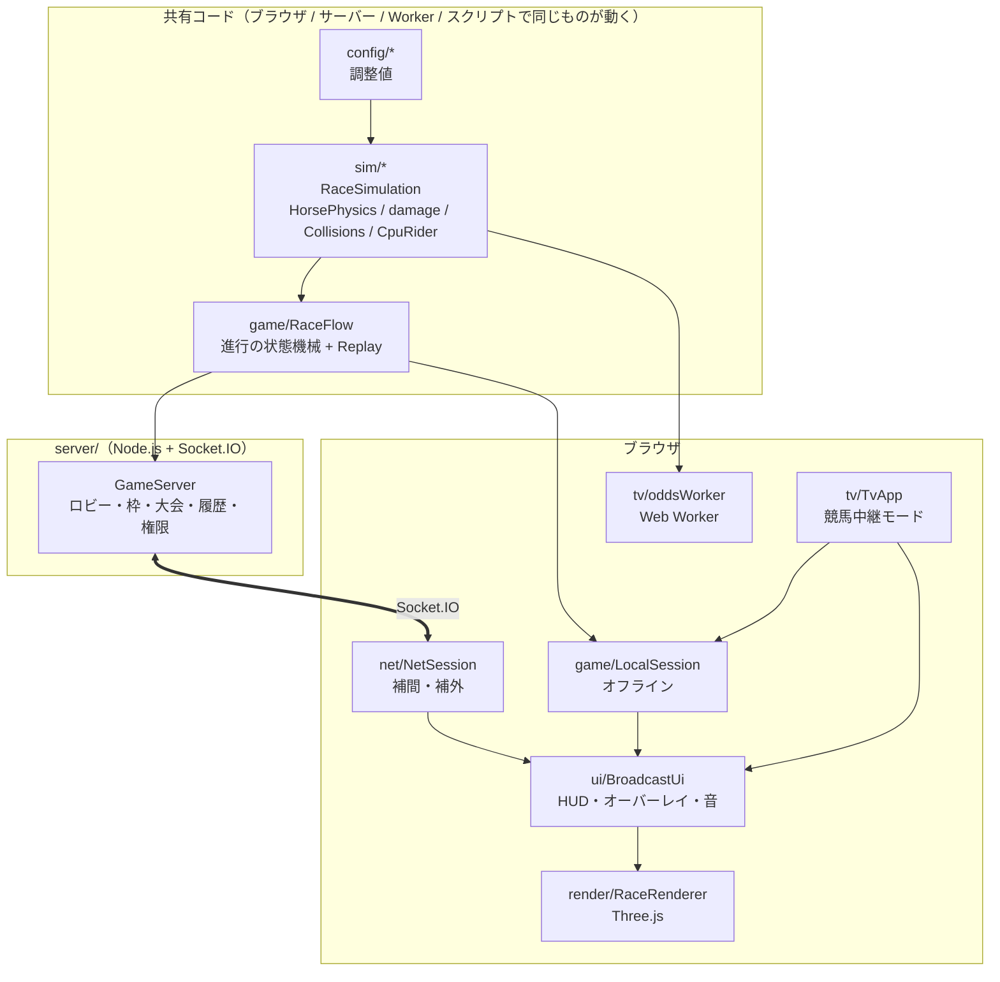
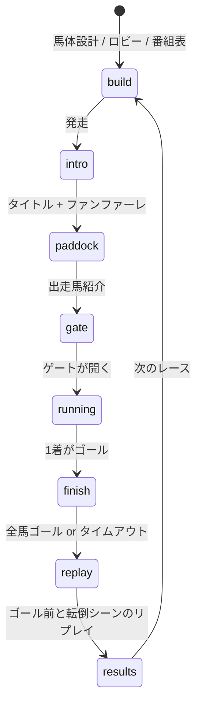
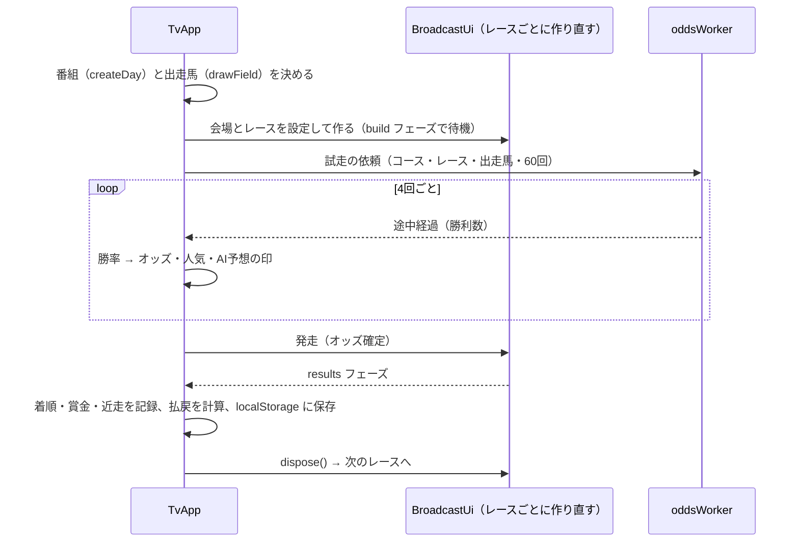

# アーキテクチャ

段ボール競馬（Cardboard Derby）の内部構造を、開発者向けに説明します。
コードはすべて Claude Code（Opus 5.5）が [`PROJECT_SPEC.md`](../PROJECT_SPEC.md) の「重要な設計原則」に沿って生成しました。

---

## 1. 全体像



### データの流れは一方向

```
HorseInput ──▶ RaceSimulation ──▶ RaceState ──▶ RaceRenderer / Hud / 実況 / スマホ
（プレイヤー or CPU騎手）  （60Hz固定ステップ）  （シリアライズ可能な純データ）
```

- 描画側は `RaceState` を**読むだけ**で、書き換えません。
- プレイヤーと CPU 騎手は、どちらも `HorseInput`（throttle / brake / steer / brace）を作るだけです。全頭が同じ物理で走ります。
- `RaceState` は JSON にできる純データです。オンラインではサーバーからそのまま（差分を圧縮して）送られます。

---

## 2. シミュレーション（`src/sim/`）

| ファイル | 役割 |
|---|---|
| `Course.ts` | 直線2本＋半円2つのコース形状。距離 s と横位置から座標・向き・区間を返す |
| `RaceSimulation.ts` | 全馬の状態を持ち、固定ステップで進める。イベント（転倒、接触、部品脱落など）を記録する |
| `HorsePhysics.ts` | 駆動、空気抵抗、コーナリングの横G、ロール（傾き）と転倒、踏ん張る、構造疲労、ピットと修理 |
| `damage.ts` | 部位ごとの耐久・接合強度・変形・脱落、修理後の劣化 |
| `Collisions.ts` | 馬同士とラチの衝突。衝撃の大きさから損傷を与える |
| `CpuRider.ts` | CPU騎手。脚質ごとのペース配分、コーナー手前の減速、危ない時に踏ん張る、ピットの判断 |
| `performance.ts` | 馬体（6項目）から質量・最高速・加速・コーナー限界・壊れやすさ・修理時間を計算する |
| `buildType.ts` | 性能から異名（直線番長、ちゃぶ台など）を判定する |

### 乱数と再現性
- `core/rng.ts` はシード付きの PRNG（mulberry32）です。同じシードと同じ入力なら、同じレースが再現されます（`?seed=`）。
- 競馬中継モードの「調子」（`pacingConfig.conditionSpread`）は**別の乱数列**を使います。この設定が 0 の通常モードでは、乱数の消費順が変わらず、既存のレースはまったく同じに再現されます。

---

## 3. レース進行（`src/game/RaceFlow.ts`）



- `RaceFlow` は描画をまったく知りません。サーバーでもブラウザでも同じコードが動きます。
- `Replay.ts` はレース中の状態を30fpsで記録し、ゴール前と転倒シーンを選んでスロー再生します。

### Session（オンラインとオフラインの共通の窓口）
- `Session` インターフェースを `LocalSession`（このタブでシミュレーション）と `NetSession`（サーバーの状態を受信）が実装します。
- 描画の `BroadcastUi` は Session しか見ないので、どちらで動いているかを気にしません。

---

## 4. ネットワーク（`server/`, `src/net/`）

### 権威サーバー
- サーバーが `RaceFlow` を動かして勝敗を決めます。クライアントは入力を送るだけです。
- スナップショットは **20Hz** です。クライアントは遅延（基本120ms。届く間隔に合わせて自動で調整）を置いて補間し、届かない間は補外します。

### 主なイベント

| 方向 | イベント | 内容 |
|---|---|---|
| C→S | `join` | 役割（host / player / commentary）、本人確認トークン、馬体 |
| C→S | `input` | 操作入力（スマホ / キーボード） |
| C→S | `presence` | 画面の表示状態（隠れたら CPU が代走） |
| C→S | `start` / `skip` / `rematch` | 発走・スキップ・再戦（権限による） |
| C→S | `admin:auth` / `admin:command` | 管理者の PIN 認証とコマンド |
| S→C | `welcome` / `assigned` / `entry` | 接続・枠の割り当て・エントリーの状態 |
| S→C | `setup` | 新しいレースの出走表・コース・レース情報 |
| S→C | `snap` | スナップショット（差分エンコード） |
| S→C | `tournament` / `notice` / `admin:state` | 大会の状態、お知らせ、管理画面の状態 |

### 通信量の削減（Phase 10）
- **部位データの差分化**：変化の少ない部位の状態（耐久・接合・変形）は、変わった時だけ送ります。2秒ごとにキーフレームとして全量を送ります（途中から接続した端末のため）。
- **精度の最適化**：通常は小数第2位、精度が必要な値だけ第3位に丸めます。
- **perMessageDeflate**（512バイト以上のメッセージを圧縮）。
- 結果：1スナップショット 約1.9KB → 約1.05KB（圧縮前）→ 約0.5KB（圧縮後）。

### 本人確認と CPU 代走
- 各タブは sessionStorage に**本人確認トークン**を持ちます。リロードや再接続をしても同じ馬に戻れます。
- 他の端末に送るのは**公開ID**だけで、トークンは送りません（Phase 9 で見つけた漏洩を修正）。
- 切断した時やスマホの画面を消した時は、その馬を **CPU が代走**し、戻ると操作が戻ります。

---

## 5. 描画（`src/render/`）

| ファイル | 役割 |
|---|---|
| `RaceRenderer.ts` | シーン全体。メインカメラと追走カメラ（ピクチャー・イン・ピクチャー）、解像度の自動調整、`dispose()` |
| `BroadcastDirector.ts` | 中継カメラのディレクター。進行と馬の位置からショットを選ぶ（スタート地点、向正面、4コーナー、最終直線の正面、ゴール前、ウイナー、リプレイ） |
| `HorseModel.ts` | 段ボール馬の手続き的なモデル。同じ素材のメッシュを統合して描画回数を減らす |
| `DamageVisuals.ts` | ガムテープの剥がれ、脚の曲がり、取れた部品の見た目 |
| `Facilities.ts` | スタンド、観客、大型ビジョン（Canvas で順位を描画）、発馬機 |
| `Dust.ts` | 蹄が跳ね上げる土と芝のパーティクル（Points シェーダー） |
| `TrackBuilder.ts` / `Environment.ts` | 芝、ラチ、距離標、空、木、山 |
| `textures.ts` | 段ボール・芝などのテクスチャを Canvas で生成 |

- **画質プリセット**（高 / 中 / 低）：影、アンチエイリアス、描画解像度の上限、観客の数、パーティクルの量を切り替えます。
- **解像度の自動調整**：フレーム時間が長くなると描画解像度を下げ（最低0.6倍）、余裕が戻れば元に戻します。

---

## 6. 競馬中継モード（`src/tv/`）



| ファイル | 役割 |
|---|---|
| `Stable.ts` | 所属馬（元の6頭＋自動生成。名前・馬体・騎手・それまでの戦績） |
| `Programme.ts` | 1日12レースの番組（クラス、距離、発走時刻、賞金）、クラスに合った出走馬の選び方、休養間隔 |
| `odds.ts` | 試走（`trialRace`）、勝率の推定（試走78% + 賞金から見た評判22%）、控除率20%のオッズ、人気、予想の印、払戻 |
| `oddsWorker.ts` | 試走を Web Worker で回す（中継のフレームレートを落とさないため） |
| `TvGuide.ts` | 番組表・出馬表・1日のまとめの画面 |
| `TvApp.ts` | 全体の進行、キー操作、保存と再開 |

- **レースごとに `BroadcastUi` を作り直します**。会場・距離・レース名・頭数（6〜8頭）が毎回変わるためです。そのため `RaceRenderer.dispose()` で GPU のリソースと WebGL コンテキストを解放し、`Particles.dispose()` でイベントリスナーを外します。音声エンジン（`BroadcastAudio`）は作り直さずに使い回すので、一度許可した音はレースが替わっても出続けます。
- 検証：`npm run tv:sim -- 4` で、4日分（48レース）を番組作成から確定まで、ヘッドレスで再現できます。

---

## 7. 音（`src/ui/BroadcastAudio.ts`）

- 音声ファイルを使わず、**WebAudio のオシレーターとノイズで合成**しています。グレード別のファンファーレ、発走のベル、歓声、蹄の音、きしみ、テープが剥がれる音、部品が飛ぶ音、修理の音、踏ん張りの音があります。
- 音量はファンファーレ・効果音・歓声の別々の系統（バス）で調整できます。
- ブラウザの制限で、最初のクリックかキー入力の後に音が出始めます。

---

## 8. 永続化

| データ | 保存場所 |
|---|---|
| 馬体設計・設定（画質、音量など） | ブラウザ（localStorage） |
| 本人確認トークン | タブ（sessionStorage） |
| 競馬中継モードの所属馬・開催日 | ブラウザ（localStorage、`cardboard-derby-tv-v1`） |
| レース結果の履歴 | サーバー `data/results.json` |
| 大会 | サーバー `data/tournament.json` |
