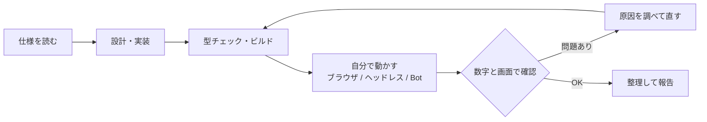

# Claude Code（Opus 5.5）による一括生成の記録

このリポジトリは、**[Claude Code](https://claude.com/claude-code) + Claude Opus 5.5** が、1つの仕様書から生成しました。
このページには、何をどう頼み、AI が何を自分で判断して作り、確かめ、直したかを記録しています。

---

## 人間がしたこと

1. ゲームの仕様書 [`PROJECT_SPEC.md`](../PROJECT_SPEC.md) を書きました。
   - コンセプト（「速い馬」ではなく「壊れずに走りきった馬」が勝つ）
   - 最終的な姿（Player / Host / Commentary / Admin の4画面）
   - 設計の原則（シミュレーションと描画を分ける、ハードコードしない、マルチプレイヤーを見越す）
   - 物理と損傷の考え方、中継の演出、大会モード、統計
   - **Phase 1〜10 の開発計画**と、各フェーズの「作る → 動かす → 確かめる → 直す → 整理する」というルール

---

## Claude Code がしたこと

各フェーズで、Claude Code は次のサイクルを人の手を借りずに回しました。

### 「自分で動かして確かめる」の具体例

| 道具                         | 使い方                                                                                                |
| ---------------------------- | ----------------------------------------------------------------------------------------------------- |
| アプリ内のブラウザ           | 画面を開いてスクリーンショットで見た目を確認する。スマホの画面幅も試す。JavaScript で内部の状態を読む |
| ヘッドレスのシミュレーション | 描画なしで数百レースを走らせ、脚質ごとの勝率、転倒率、イベントの数を測る（`scripts/simBalance.ts`）   |
| Bot クライアント             | Socket.IO の Bot をつなぎ、レースの完走、再接続、権限、大会の通しを自動で試す（`scripts/net*.ts`）    |
| 負荷試験                     | Bot のスマホ40台で、大会全11レースを走らせる（`scripts/botSwarm.ts`）                                 |
| 難易度の測定                 | 自動操縦のプレイヤーを CPU の強さ別に走らせて勝率を測る（`scripts/difficulty.ts`）                    |
| 競馬中継モードの検証         | 4日分の番組をヘッドレスで回し、1番人気の勝率と配当を測る（`scripts/tvSim.ts`）                        |

---

## AI が自分で見つけて直した問題（抜粋）

| フェーズ（目安） | 見つけたこと                                                                | 直し方                                                                                                     |
| ---------------- | --------------------------------------------------------------------------- | ---------------------------------------------------------------------------------------------------------- |
| 2                | 操舵の横加速度だけで転倒限界を超えてしまう                                  | 操舵の加速度に上限を付け、コーナーの横Gと分けて扱う                                                        |
| 2〜3             | 転倒した馬に後ろの馬が次々にぶつかり、玉突き事故になる                      | 倒れた馬の当たり判定と、CPU の回避を調整する                                                               |
| 3                | ピットインの判断が堂々巡りして止まる                                        | ピットの要求・取り消し・修理の状態遷移を整理する                                                           |
| 6                | 環境変数 `PORT` がプレビュー用のサーバーとぶつかる                          | ゲームサーバーは `GAME_PORT` を使う                                                                        |
| 9                | 他の端末に送るデータに本人確認トークンが入っていた                          | 公開IDとトークンを分け、トークンは送らない                                                                 |
| 7                | スマホのロビーのボタンを毎秒作り直していて、タップを取りこぼす              | 変わった時だけ作り直す                                                                                     |
| 7                | スマホの操作パネルが画面幅からはみ出す                                      | レイアウトを見直す                                                                                         |
| 8                | 管理画面の「このPCから」の判定がプロキシ経由で効かない                      | X-Forwarded-For を正しく扱う                                                                               |
| 10               | 組分けの後に登録があると、組分けが白紙に戻る                                | 一番人数の少ない組に追加し、空きが無い時だけ組み直す                                                       |
| 10               | 「つよい」CPU をコーナーで攻めさせると、構造疲労が溜まって逆に遅くなる      | 攻めの強さではなく、ミスの少なさと反応の速さで差を付け、最高速 +0.8% の補正を加える（勝率 54% / 26% / 9%） |
| 10               | 土埃のパーティクルが小さすぎ、芝と同じ色で見えない                          | 投影行列から画面上の大きさを計算し、茶色と緑の土と芝の色にする                                             |
| +                | 競馬中継モードで1番人気が勝ちすぎる（63%）                                  | 馬ごとの「調子」（最高速 ±4%）とペースの揺れを加え、31%（実際の競馬は約33%）にする                         |
| +                | レースごとに作り直す画面で、馬体設計のプレビューの WebGL コンテキストが残る | 観戦専用の画面では馬体設計の画面を作らない。レンダラーに `dispose()` を付ける                              |

---

## 計測した数字

| 項目                              | 値                                                                    |
| --------------------------------- | --------------------------------------------------------------------- |
| 描画回数（高画質）                | 665 → **470**（メッシュ統合）                                         |
| 描画の CPU 時間 / フレーム        | 1.24ms → **0.75ms**                                                   |
| スナップショット                  | 約1.9KB → 約1.05KB（圧縮前）→ **約0.5KB**（圧縮後）                   |
| Bot 40台・大会全11レース          | サーバー処理 平均 **0.12ms**・最悪 7.65ms（上限 16.7ms）              |
| 通常レースのバランス（200レース） | 1着と2着の差 平均0.48秒、首位の入れ替わり 2.4回、転倒 0.24回 / レース |
| 競馬中継モード（48レース）        | 1番人気の勝率 **31%**、3着以内 **67%**                                |

---

## 規模

|                                |                                                                                                 |
| ------------------------------ | ----------------------------------------------------------------------------------------------- |
| TypeScript                     | 約12,300行 / 83ファイル                                                                         |
| CSS                            | 約880行                                                                                         |
| 画像・3Dモデル・音声のファイル | 0個（すべてコードで生成）                                                                       |
| 実行時の依存ライブラリ         | `three` / `socket.io`（+ client）/ `qrcode`                                                     |
| 画面                           | Host（大画面）・Player（スマホ）・Commentary（実況）・Admin（管理）・Play（PC）・TV（競馬中継） |

---

## 注意

- 振動、効果音の聞こえ方、iPhone Safari での画面の高さは、自動テストとブラウザのスマホ表示でしか確かめていません。イベントで使う前に、実機でリハーサルすることをおすすめします。
- 仕様書（`PROJECT_SPEC.md`）は人間が書いたものです。
